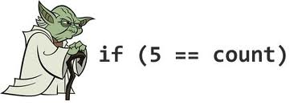

Collection of programmer’s jokes like various bug reports or types of code, then a few comments and in the end programming languages which are at least weird. Of course you will know some or most of them but I wanted to have them here, so I don’t need to seek them.

===

## Mix of everything

#### Yoda conditions

Using `if( constant == variable )` instead of `if( variable == constant )`, like `if( 4 == foo )`. Because it’s like saying “if blue is the sky” or “if tall is the man”.

#### Pokémon exception handling

For when you just Gotta Catch ‘Em All.

```
try {
    // do something
} catch( Exception e ) {
    // Gotcha!
}
```

 

#### Bug reports

**Smug report** a bug submitted by a user who thinks he knows a lot more about the system’s design than he really does. Filled with irrelevant technical details and one or more suggestions (always wrong) about what he thinks is causing the problem and how we should fix it.

**Drug report** a report so utterly incomprehensible that whoever submitted it must have been smoking crack. The lesser version is a chug report, where the submitter is thought to have had one too many.

**Shrug report** a bug report with no error message or repro steps and only a vague description of the problem. Usually contains the phrase “doesn’t work”.

**Fermat’s last post** a post to a bug tracker/email list/forum in which the author claims to have found a simple fix or workaround for a bug, but never says what it is and never shows up again to explain it (even after others have been puzzling over the bug for years).

**Floater** the case in a bug tracking system where a bug report remains “floating” at the top of the queue, but never gets assigned to a developer, maybe because there is a workaround in place.

#### Bugs

**Heisenbug** a bug that disappears or alters its characteristics when an attempt is made to study it.

**Higgs bugson** a hypothetical bug predicted to exist based on a small number of possibly related event log entries and vague anecdotal reports from users, but it is difficult (if not impossible) to reproduce on a dev machine because you don’t really know if it’s there, and if it is there what is causing it. To find these you will need to invest in a Large Hadron debugger.

**Hindenbug** a catastrophic data destroying bug – “Oh the humanity!”.

**Counterbug** a bug you present when presented with a bug caused by the person presenting the bug.

**Bloombug** a bug that accidentally generates money.

**Schrödinbug** refers to a function/feature that appears to fluctuate between buggy and correct (like Schrödinger’s cat, fluctuating between alive and dead), until somebody looks at the source code (opens the box), at which point it becomes permanently bugged.

**Loch Ness Monster Bug** a bug which cannot be reproduced or has only been sighted by one person. (Also, **Bugfoot** is a great alternative).

**UFO bug** a bug presented by customers, who, even when they’re shown that it doesn’t exist, will repeatedly report it again and again, believing it is real.

**Mandelbug** a bug whose causes are so complex that its behavior appears chaotic or even non-deterministic. Named after fractal innovator Benoît Mandelbrot.

**Brown-paper-bag bug** a bug in a public software release that is so embarrassing that the author notionally wears a brown paper bag over his head for a while.

**Sorcerer’s apprentice mode bug** a bug in a protocol where, under some circumstances, the receipt of a message causes multiple messages to be sent, each of which, when received, triggers the same bug.

**Mad girlfriend bug** a bug whose immediate effect remains hidden – the app outwardly seems to function normally and tells you that everything is fine.

**Excalibur bug** when all of the developers within a company have tried to fix a particular bug but none are worthy have succeeded, so far.

**Load-bearing printf bug** when a line of debug output is required for the code to work – the code does not function if you remove it.

#### Jimmy

Is a generalized name for clueless or new developer. You can either use it during developing new component that is requiring minimal knowledge of how it is working for other developers. So you are asking yourself : “What if Jimmy forgets to update the attribute?”. This leads to the term “Jimmy-proof” when referring to well designed code.

#### Types of code

**Spaghetti Code** code that’s got one too many GOTOs, exceptions, threads, or other “unstructured” branching constructs. Program flow tends to look like a bowl of spaghetti – twisted and tangled.

**Spaghetti with Meatballs Code** an attempt at object-oriented code, but where the end result still remains dependent on some messy procedural (spaghetti) code.

**Baklava Code** code with too many layers. Also known as **Lasagne Code**.

**Ravioli Code** object-oriented code consisting of a number of small and loosely-coupled software components.

**Sausage Code** once you’ve examined the code in detail (“how it’s made”) you’ll never want to use it again.

**Jenga Code** the whole thing collapses when you alter a block of code. Also known as **Crispy Noodle Code**.

**Hydra Code** code that cannot be fixed. One fix causes two new bugs. It should be rewritten.

**Scar Tissue Code** any code that is commented out but still included in the current and/or checked-in version.

**Hooker Code** code that is problematic and causes application instability (i.e. the application “goes down” often).

**Pig’s Lipstick Code** code which has large amount of legacy and/or spaghetti code hidden via wrapper objects, so while it appears to new developers to be well designed, elegant, object-oriented code, when they start working on it in depth they realize just how ugly it really is.

**Mortgage Code** code purposely so terrible and complicated that only you can maintain it, forcing your employer to keep you, thus providing job security (so you can pay your mortgage).

**Ghetto Code** a particularly inelegant and obviously suboptimal section of code that still meets the original requirements.

**Swiss Army Code** application code that is suffering from feature creep – it does a lot of things, but it does nothing well.

**NP Tricky Code** an algorithm whose complexity is too hard for a mere mortal to figure out.

**NP Hilarious Code** an algorithm whose complexity is “a joke”, literally (as in BogoSort) or metaphorically.

**Cut-and-waste Code** when someone cut and pasted code they found online (usually from a blog) into a production product; the result is usually a lot of wasted time trying to track down an obscure bug from code that undoubtedly made sense in the original context but not in our app. Also known as BDD – **Blog Driven Development**.

**Neighborhood Bike Code** a module or a piece of code that every programmer at the company has touched.

**Eraser Stains Code** code that has been written, then re-factored multiple times leaving swaths of legacy code and design. Like erasing a sheet of paper so many times, the pencil marks are no longer the problem – the large greasy stain is.

**Objectfuscated Code** object-oriented code which has been abstracted to so many levels that no-one can understand it anymore.

**Barnacle Code** any piece of code (usually a static method) which has been appended to a class where it doesn’t really belong, due to a lack of anywhere else to logically put it.

**Autopilot Code** code that was written by a programmer who was on ‘auto-pilot’ or wasn’t really thinking about what they were doing.

#### Comments

**Ninja Comments** also known as invisible comments, secret comments, or no comments.

```

```

```
//
// Dear maintainer:
//
// Once you are done trying to 'optimize' this routine,
// and have realized what a terrible mistake that was,
// please increment the following counter as a warning
// to the next guy:
//
// total_hours_wasted_here = 42
//
```

```
Exception up = new Exception("Something is really wrong.");
throw up;  //ha ha
```

```
//When I wrote this, only God and I understood what I was doing
//Now, God only knows
```

```
// drunk, fix later
```

```
// Magic. Do not touch.
```

```
#define TRUE FALSE
//Happy debugging suckers
```

```
int getRandomNumber()
{
   return 4; // chosen by fair dice roll.
             // guaranteed to be random.
}
```

#### Jokes

Some people, when confronted with a problem, think “I know, I’ll use regular expressions.” Now they have two problems.

To understand what recursion is, you must first understand recursion.

There are 10 types of people in the world. Those who understand binary and those who have regular sex.

Unix is user friendly. It’s just very particular about who its friends are.

Two bytes meet. The first byte asks, “Are you ill?” The second byte replies, “No, just feeling a bit off.”

Documentation is like sex. When it’s good, it’s very good. When it’s bad, it’s better than nothing.

Saying Java is good because it works on all operating systems is like saying anal sex is good because it works on all genders.

## Programming languages

Some programmers have from time to time a weird desire to create a new “language”. Sometimes for fun and sometimes only to torment other programmers. Here is a “Hello World!” example in a couple of such languages.

#### Arnold C

```
IT'S SHOWTIME
TALK TO THE HAND "hello world"
YOU HAVE BEEN TERMINATED
```

#### Malbolge

```
('&%:9]!~}|z2Vxwv-,POqponl$Hjig%eB@@>}=<M:9wv6WsU2T|nm-,jcL(I&%$#"
 `CB]V?Tx<uVtT`Rpo3NlF.Jh++FdbCBA@?]!~|4XzyTT43Qsqq(Lnmkj"Fhg${z@>
```

#### Brainfuck

```
++++++++[>++++[>++>+++>+++>+<<<<-]>+>+>->>+[<]<-]>>.>---.+++++++..+++.>>.<-.<.+++.------.--------.>>+.>++.
```

#### reMorse

```
- - - ..- ...-.---.;newline
- - - .-. - ..-.- ...-. ---.;!
- - - ...- . . -.---.;d
----. . . -.---.;l
----. . -...---.;r
----. -...---.;o
----...-.- ..-. ---.;W
//author didn't feel like doing this part
-..............;output all characters
```

#### Piet


## Conclusion

Hope you had fun during reading this post and if you find some ridiculous comment or anything else that entertained you, don’t be egoistic and share it – for now only by sending it to me and I hope in the near future the comments will be available.

#### References

[Yoda conditions, pokemon exception handling and other programming classics](http://www.dodgycoder.net/2011/11/yoda-conditions-pokemon-exception.html)

[New programming jargon](http://blog.codinghorror.com/new-programming-jargon/)

[StackOverflow – What is the best comment in source code you have ever encountered?](http://stackoverflow.com/questions/184618/what-is-the-best-comment-in-source-code-you-have-ever-encountered?page=1&tab=votes#tab-top)

[Arnold C](https://github.com/lhartikk/ArnoldC) GitHub page with a little documentation.

[Factorial example on GitHub](https://github.com/vasiliybondarenko/ArnoldCSamples/blob/master/factorial.arnoldc)

[Malbolge wikipedia page](https://en.wikipedia.org/wiki/Malbolge)

[Brainfuck wikipedia page](https://en.wikipedia.org/wiki/Brainfuck)

[10 most bizarre programming languages](http://code.tutsplus.com/articles/10-most-bizarre-programming-languages-ever-created--net-2412) where I found reMorse.

[Piet, an easy tutorial](http://homepages.vub.ac.be/~diddesen/piet/index.html) if you are interested how it works.

[Samples](http://www.dangermouse.net/esoteric/piet/samples.html) of common problems solved in Piet language.

[the_coding_love()](http://thecodinglove.com/) and many many animated pictures.
