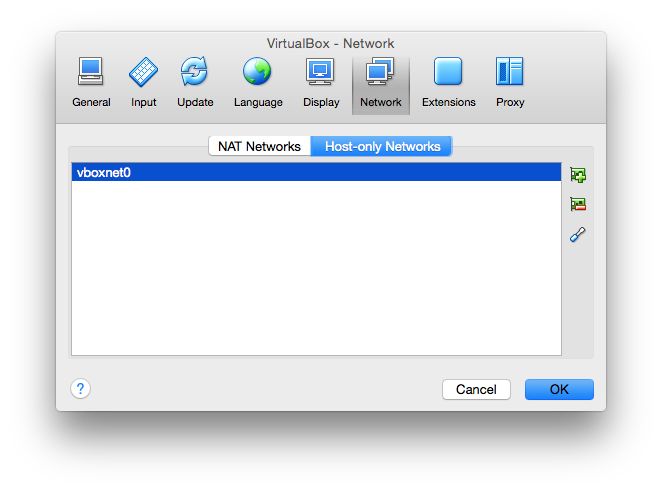
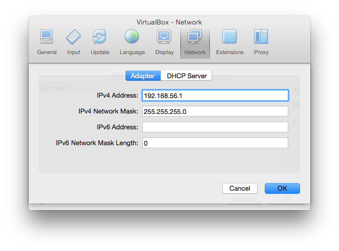
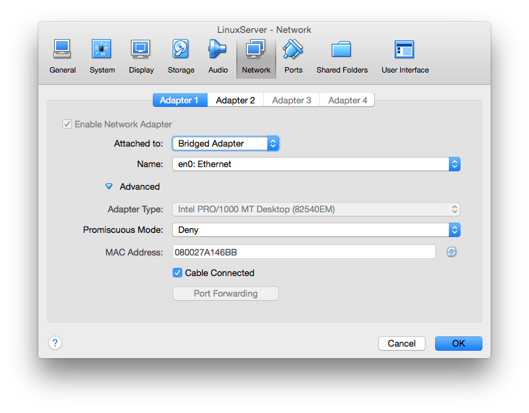
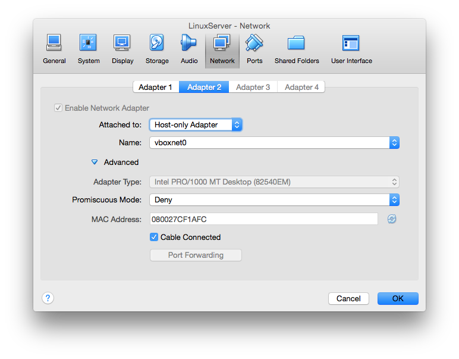

Static IP address on Virtual Machine with access to internet
Set up Ubuntu in Virtual machine to be accessible from your computer always under one IP address and still be able to connect to internet from the machine took me a while. Here is my procedure to acquire it.

===

As I wrote in my previous post I want to have Virtual Machine with all services I need ( Apache server, MySql, Elasticsearch, etc. ) saved on USB drive. Next thing I have to set is the network.

The server should have static IP address but still have to be able to connect to internet. And this may cause a little troubles. There are a few things to be set in Virtual Box and in Linux server either.

P. S.: why I need static IP? It is because I don’t want to check its IP address every time I run the server. So one network interface is used for connecting to internet and the other is for me connecting to the server.

## Virtual Box

Let’s start with the Virtual Box settings…

#### Host-only Networks

Go to *VirtualBox -> Preferences and click on Network* “tab”. You should see an empty list and above it there are two buttons – “Nat Networks” and “Host-only networks”. Choose the second one and on the right there is a plus button by which you can add new host-only network. Click on it and you should see a form where you can set IPv4 Address, network mask, etc. Default IPv4 address value is `192.168.56.1` and network mask `255.255.255.0`. In *DHCP Server* tab you can disable the server. Then click *OK* and *OK* again.

  

#### Machine settings

Open machine settings and click on *Network* tab. In *Adapter 1* for *Attached to* setting choose value *Bridged Adapter* with *Name en0: Ethernet* ( I am on Mac, so you may have other names for network interfaces ). Then go to *Adapter 2* and choose *Host-only Adapter* with *Name vboxnet0*. Confirm it with OK and start the machine.

 

## The server part

When you run the machine for the first time, it should have access to the internet ( if “parent” computer has it of course ). So I assume ever this part is ok.

#### Install the Guest additions

There are some things needs to be installed like drivers and system applications to your virtual machine system. They help it with performance and better usability. Without this I was unable to set the network interface to work how I wanted. So…on Ubuntu server run these commands :

```
sudo apt-get update
sudo apt-get install dkms
```

If you are using some other system, please visit VirtualBox official website and read [User Manual](https://www.virtualbox.org/manual/UserManual.html). There is a part focusing on installing these additions on various systems.

#### Setup the network interfaces

On of the last steps is to say the system to use two primary network interfaces. One is used for internet connection and the other is for you to connect. When you run <kbd>ifconfig</kbd> command you should see *eth0* and *lo* interfaces. You need to add a new one. This is done by writing it into configuration file. For this you need super user permissions and open it with <kbd>sudo vi /etc/network/interfaces</kbd>.

The loopback network interface *lo* and *eth0* interface remains unchanged. You only add *eth1* which is static and set the IP address it should use. The final file then looks like this :

```
# This file describes the network interfaces available on your system
# and how to activate them. For more information, see interfaces(5).
# The loopback network interface
auto lo
iface lo inet loopback

# The primary network interface
auto eth0
iface eth0 inet dhcp

auto eth1
iface eth1 inet static
  address 192.168.56.107
  netmask 255.255.255.0
  network 192.168.56.0
  broadcast 192.168.56.255
  #gateway 192.168.56.1
```

Note that the last line `#gateway 192.168.56.1` is commented out. It is because of overriding the *eth0* settings and the system would connect to internet through this gateway which is not working. So with this you prevent using it and everything should be ok.

## Conclusion

This is all, now you can restart your machine and then connect to it with <kbd>ssh &lt;user&gt;@192.168.56.107</kbd>. If there is any other service running on the server, you can also add it in your hosts file, so you do not need to enter IP address but only the name.

#### References

[Virtual networking](https://www.virtualbox.org/manual/ch06.html) documentation where you can find for example differences among networking modes like NAT and Bridged networking.

[Guest additions](https://www.virtualbox.org/manual/ch04.html) documentation. What you need to install on a particular OS, etc.
