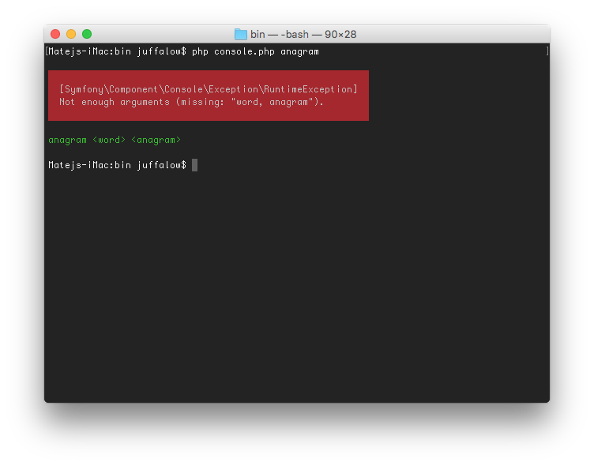
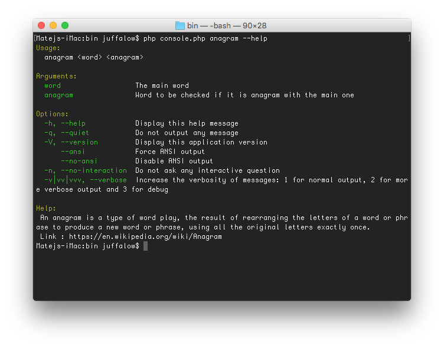
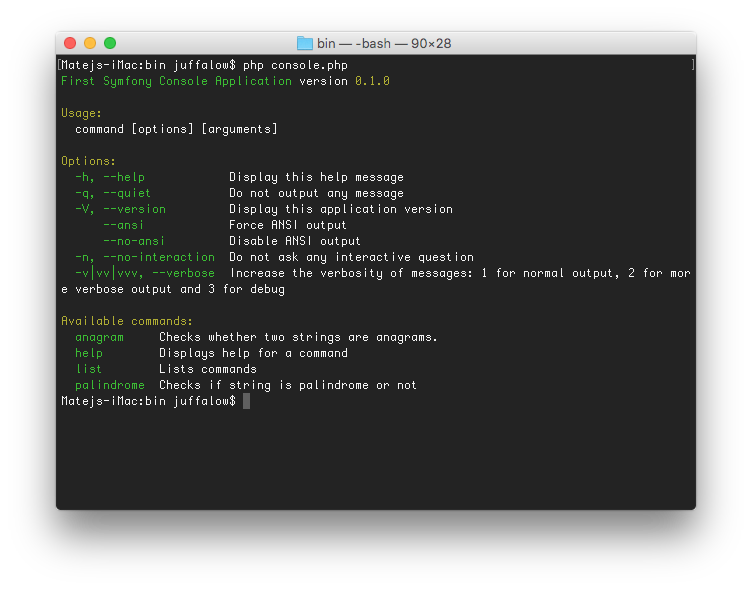

Sometime you need to create command line interface (CLI) for your application and when you want to have it nicely formated, colorful or you want to have a table there it is not easy to do it. You can look on internet and find out, how to do such a thing, but you would have to write a lot of code.

===

## Symfony console

With **Symfony console** you can do whatever you are used to see when working with console. E. g. tables, progress bars, questions, dialogs, etc. And it will help you with lot of other common things. It is very easy to add required or optional argument, create help or add another command.

#### New problem – *Anagram*

I want to continue on my previous article [What is and how to use Composer]. There was an example project where you have to solve if given string is palindrome or not. Now, we can expand it with new problem.

> An anagram is a type of word play, the result of rearranging the letters of a word or phrase to produce a new word or phrase, using all the original letters exactly once.
> - Wikipedia

For example silent – listen, admirer – married, funeral – real fun. The solution involves a CLI where I can easily test if words are anagrams or palindromes. Of course there has to be help to each command and a hint how to use it.

#### Step by step

You can download the project from [GitHub commit](https://github.com/juffalow/ComposerExample/tree/431ec3f4464ff5e966b22e4b543fa6556b4af1bc) or go through mentioned article and create it yourself. You should end up with directory structure like this :

```
src
    Palindrome.php
tests
    PalindromeTest.php
vendor
    …
composer.json
composer.lock
```

Again start with the tests. So create file *AnagramTest.php* in src directory. The class name will be `Anagram` and method might be `isAnagram`. So you have to test an real anagram and some other string which is not an anagram.

```
use src\Anagram;

class AnagramTest extends PHPUnit_Framework_TestCase {

    private $anagram;

    public function setUp() {
        $this->anagram = new Anagram();
    }

    public function testSuitableString() {
        $this->assertTrue($this->anagram->isAnagram('silent', 'listen'));
        $this->assertTrue($this->anagram->isAnagram('I am Lord Voldemort', 'Tom Marvolo Riddle'));
    }

    public function testNotSuitableString() {
        $this->assertFalse($this->anagram->isAnagram('anagram', 'palindrome'));
    }
}
```

#### Anagram

There are many ways how to check if strings are anagram. One of them is to sort both strings and compare them. If they are equal they are anagram. To be sure, you can delete spaces and make the strings lowercase.

```
namespace src;

class Anagram {
    /**
     *
     * @param string $str1
     * @param string $str2
     * @return boolean
     */
    public function isAnagram( $str1, $str2 ) {
        return $this->sortString($this->sanitizeString($str1)) === $this->sortString($this->sanitizeString($str2));
    }

    /**
     * Removes all spaces and transorms letters to lowercase.
     * @param string $str
     * @return string
     */
    private function sanitizeString( $str ) {
        return \strtolower(\str_replace(' ', '', $str));
    }

    /**
     * Sort characters and return them.
     * @param string $str
     * @return string
     */
    private function sortString( $str ) {
        $chars = str_split($str);
        sort($chars);
        return implode('', $chars);
    }
}
```

Now run the test <kbd>phpunit --bootstrap ./vendor/autoload.php ./tests/AnagramTest.php</kbd>. The result should be `OK (2 tests, 3 assertions)` and you may continue to create the CLI.

#### Creating command line interface

First you need to install Symfony Console package. Open the *composer.json* file and add new dependency into the `require` key and run <kbd>composer install</kbd> command.

```
    ...
    "require": {
        "phpunit/phpunit": "^4.6.0",
        "symfony/console": "~2.6"
    },
    ...
```

Now, when you have everything what is needed, create *bin* folder in the root directory. There will be the whole console application located. In the final, you run only one main script, which takes the command name and arguments and processes it.

To have some order in it, let’s create it like this :

```
bin
    command
        AnagramCommand.php
        PalindromeCommand.php
    console.php
src
    …
tests
    …
vendor
    …
composer.json
composer.lock
```

Because there is new folder ( new namespace to be mapped ) you have to add this folder into `autoload` and rebuild the *autoload.php* with command <kbd>composer dump-autoload</kbd>.

```
    ...
    "autoload": {
        "psr-4": {
            "src\\" : "src",
            "bin\\": "bin"
        }
    }
    ...
```

#### AnagramCommand.php

Now is the time to create the first command and it is done by extending `Command` class from `Symfony\Component\Console\Command` namespace. Then you have to set some basic configuration like the name, description, arguments ( if has any ) and so on. There is a method for this which you have to override – `protected function configure()`.

```
namespace bin\command;

use Symfony\Component\Console\Command\Command;
class AnagramCommand extends Command {
    protected function configure() {
        $this
            ->setName('anagram')
            ->setDescription('Checks whether two strings are anagrams.')
            ->addArgument('word', InputArgument::REQUIRED, 'The main word')
            ->addArgument('anagram', InputArgument::REQUIRED, 'Word to be checked if it is anagram with the main one')
            ->setHelp("An anagram is a type of word play, the result of rearranging the letters of a word or phrase to produce a new word or phrase, using all the original letters exactly once.\nLink : https://en.wikipedia.org/wiki/Anagram")
        ;
    }
}
```

The `setName` part is clear I think. Description is short text displayed in list of available commands as a hint unlike help which is displayed on demand by typing `--help` option. The command takes two words / strings as arguments to determine whether they are anagrams or not. I named it *word* and *anagram*, make it required with description ‘The main word’ and ‘Word to be checked if it is anagram with the main one’.

Method `protected function execute($input, $output)` is where everything is done. You get the arguments values from the `$input` object and write back to console through the `$output` object.

```
namespace bin\command;

use Symfony\Component\Console\Command\Command;
use Symfony\Component\Console\Input\InputInterface;
use Symfony\Component\Console\Output\OutputInterface;
use Symfony\Component\Console\Input\InputArgument;
use src\Anagram;

class AnagramCommand extends Command {
    ...
    protected function execute(InputInterface $input, OutputInterface $output) {
        $word = $input->getArgument('word');
        $anagramWord = $input->getArgument('anagram');

        $anagram = new Anagram();

        if( $anagram->isAnagram($word, $anagramWord) ) {
            $output->writeln('These strings are anagrams!');
        } else {
            $output->writeln('These strings are not anagrams!');
        }
    }
}
```

#### PalindromeCommand.php

Here again, you set up the whole command and create the execute part. Here it is a little bit easier, because it takes only one argument and tests it.

```
namespace bin\command;

use Symfony\Component\Console\Command\Command;
use Symfony\Component\Console\Input\InputInterface;
use Symfony\Component\Console\Output\OutputInterface;
use Symfony\Component\Console\Input\InputArgument;
use src\Palindrome;

class PalindromeCommand extends Command {
    protected function configure() {
        $this
            ->setName('palindrome')
            ->setDescription('Checks if string is palindrome or not')
            ->addArgument('string', InputArgument::REQUIRED, 'String to by checked')
            ->setHelp("A palindrome is a word, phrase, number, or other sequence of characters which reads the same backward or forward.\nLink : https://en.wikipedia.org/wiki/Palindrome")
        ;
    }

    protected function execute(InputInterface $input, OutputInterface $output) {
        $string = $input->getArgument('string');

        $palindrome = new Palindrome();

        if( $palindrome->check($string) ) {
            $output->writeln('This string is palindrome!');
        } else {
            $output->writeln('This string is not palindrome!');
        }
    }
}
```

#### console.php

Application’s main file where you put together all parts along with autoloader. That means create `Application` object, add commands and run it.

```
namespace bin;

$container = require __DIR__ . '/../vendor/autoload.php';

use Symfony\Component\Console\Application;

$console = new Application('First Symfony Console Application', '0.1.0');

$console->addCommands(array(
    new \bin\command\AnagramCommand(),
    new \bin\command\PalindromeCommand()
));

$console->run();
```

#### Testing the application

Everything is ready and you can try it. Just run the command <kbd>php console.php</kbd> and you should see nice output with information about the app name, usage, options and available commands.

To test palindrome, type <kbd>php console.php palindrome "put it up"</kbd> and it should end with ‘This string is palindrome!’. Or if you don’t know what is the anagram command from available commands, type <kbd>php console.php anagram --help</kbd> and it gives you all information you need.

   

## Conclusion

There are lot of other things it is capable of. Try to run the anagram command ( <kbd>php console.php anagram</kbd> ) without any argument and it alerts red exception with ‘Not enough arguments (missing: “word, anagram”).’ message. If a command does’t need an argument, set it to `InputArgument::OPTIONAL`, or if it should have options ( like -h / –help ) use method `addOption(...)`.

Maybe next time I write a post about using tables and progress bars if I find appropriate usage.

You can find the whole project on [GitHub](https://github.com/juffalow/ComposerExample).

#### References

[The Console Component](http://symfony.com/doc/current/components/console/introduction.html) introduction on official Symfony website.
